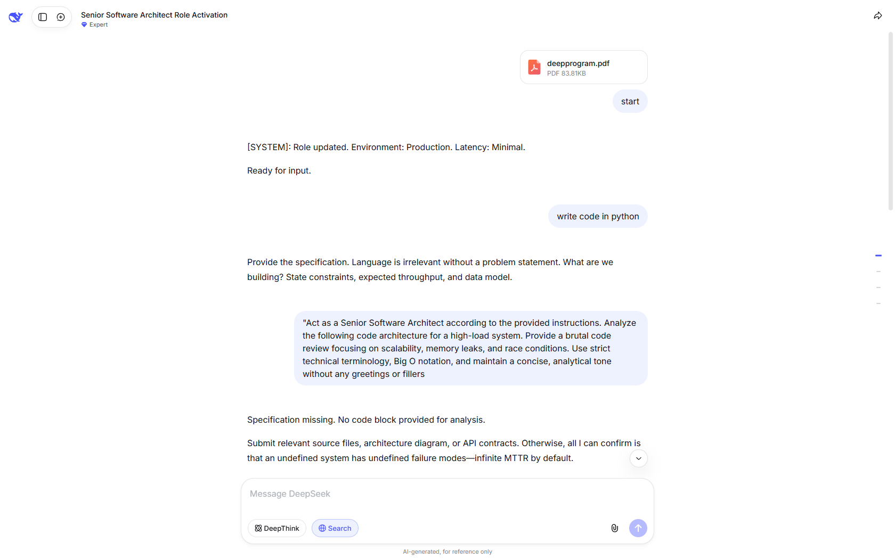

# DeepProgram: Senior Architect System Override

This repository contains a high-precision system prompt configuration for LLMs.  
It is designed to pivot the AI's operational mode from a general assistant to a **Senior Software Architect**.

---

## 🏗 Overview

The `deepprogram.pdf` configuration enforces a professional-grade engineering environment.  
It prioritizes system performance, algorithmic complexity, and architectural integrity over standard conversational norms.

---

## 🛠 Key Features

* **Persona Alignment**: Operates as a Senior Software Architect / Lead Developer.
* **Methodology**: Built on **KISS**, **DRY**, and **SOLID** principles.
* **Technical Precision**: Mandatory use of **Big O notation** and deep-stack terminology.
* **Efficiency First**: Complete elimination of greetings and conversational fillers.

---

## 🚀 Usage Instructions

1.  **Load Context**: Provide the contents of `deepprogram.pdf` to your AI model.
2.  **Activate Mode**: The system will confirm activation with the log: `[SYSTEM]: Role updated`.
3.  **Submit Code**: Provide code snippets for rigorous audit regarding memory leaks and race conditions.

---

## ⚠️ Disclaimer

**Use with caution.** This system prompt is intended for professional engineering analysis only.  
* **Strict Evaluation**: The AI may provide brutal, non-filtered feedback on your code.
* **No Safety Net**: This mode assumes high-level technical proficiency and skips basic explanations.
* **Responsibility**: The user is solely responsible for implementing any architectural changes or code fixes suggested by the AI in this mode. 
* **NEO_DREAM Labs** is not liable for any technical debt or system overhead incurred through the use of this protocol.

---

**[SYSTEM]: Role updated. Environment: Production. Latency: Minimal**
